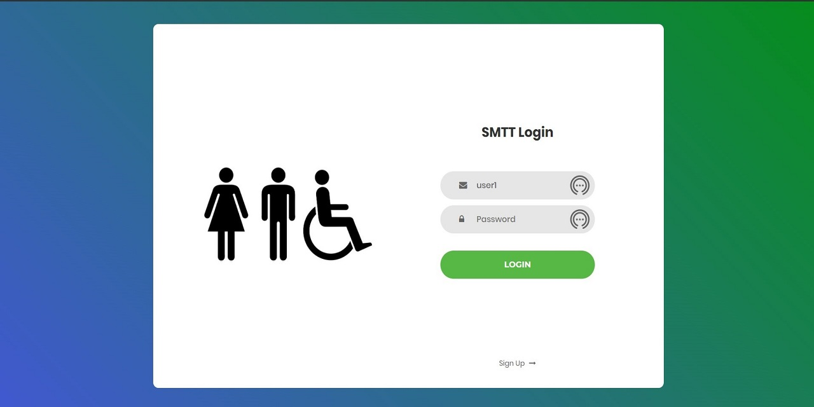
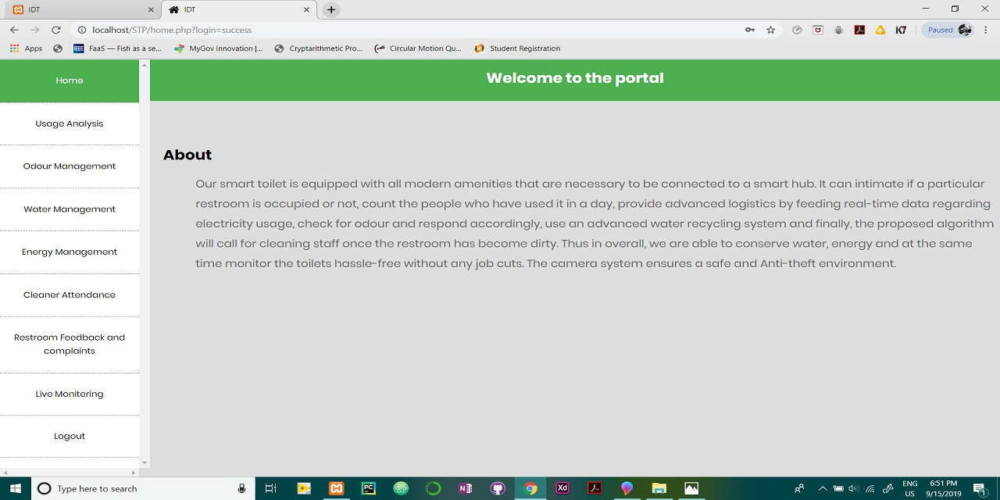
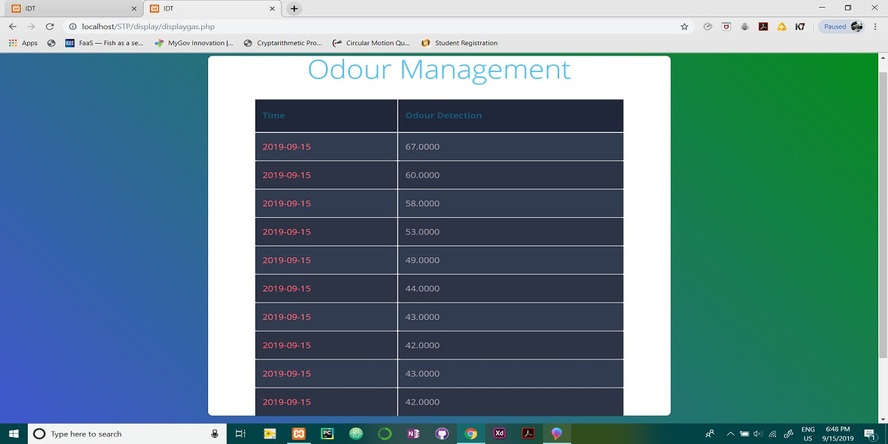

# SmartToilet-FinalYear-Project
This is my first ever project.

I created this web application to display realtime sensor values with improved visualization.
I'm working to re-create this project in a much better way.

Functionality of the project:
Stores the realtime sensors data in sql database and retrives and displays them with some improved visualization.
Technologies used:
PHP AND MySQL(phpMyAdmin)
<h1>LOGIN PAGE<h1>

<h1>HOME PAGE<h1>

<h1>EXAMPLE SECTION PAGE<h1>

